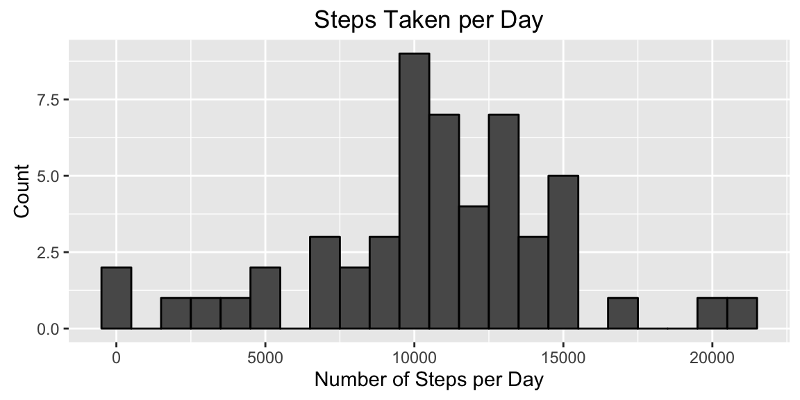
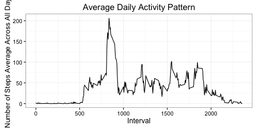
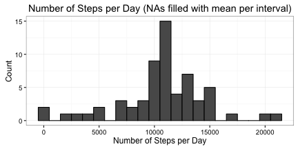
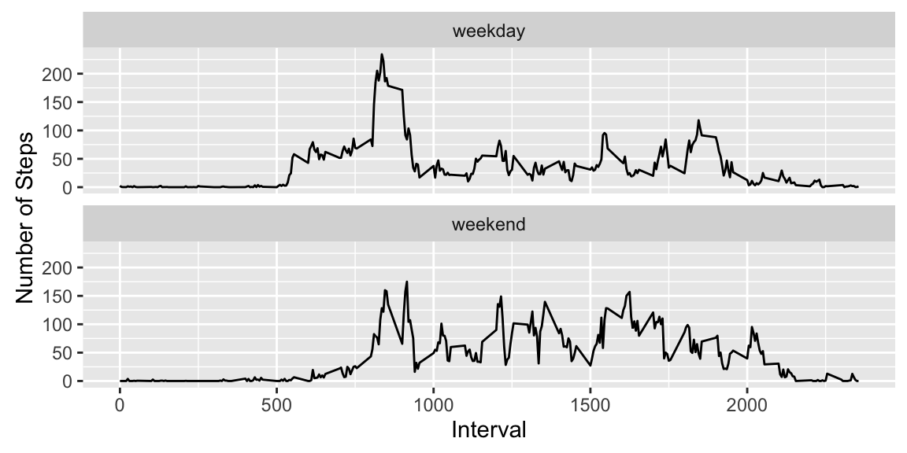

```r
knitr::opts_chunk$set(fig.width=6, fig.height=3, fig.path='figs/',
                      echo=TRUE, warning=FALSE, message=FALSE)
```

Load libraries

```r
if (!require("ggplot2")) install.packages("ggplot2")
if (!require("timeDate")) install.packages("timeDate")
library(ggplot2)
library(timeDate)
```

Read data file activity.zip into data frame "activity"

```r
mydir <- "RepData_PeerAssessment1"
myfile <- paste(mydir, list.files(mydir, pattern = "zip"), sep = "/")
myfile
```

```
## [1] "RepData_PeerAssessment1/activity.zip"
```

```r
activity <- read.csv(unzip(myfile), header = TRUE, sep = ",")
```

What is mean total number of steps taken per day?
    
Calculate sum of steps per day

```r
steps_per_day <- aggregate(steps ~ date, activity, sum)
```

Plot histogram

```r
ggplot(steps_per_day, aes(x = steps)) +
        geom_histogram(col = "black", binwidth = 1000) +
        labs(title = "Steps Taken per Day",
             x = "Number of Steps per Day",
             y = "Count") +
             theme_bw()
```



Calculate mean and median

```r
steps_mean <- mean(steps_per_day$steps, na.rm = TRUE)
steps_median <- median(steps_per_day$steps, na.rm = TRUE)
steps_mean
```

```
## [1] 10766.19
```

```r
steps_median
```

```
## [1] 10765
```
  
Answer 
Mean: 10766.1886792453  
Median: 10765  
  
  
What is the average daily activity pattern?

Calculate number of steps per interval

```r
steps_per_interval <- aggregate(activity$steps,
                                by = list(interval = activity$interval),
                                FUN = mean,
                                na.rm = TRUE)

colnames(steps_per_interval) <- c("interval", "steps")
```

Plot steps_per_interval

```r
ggplot(steps_per_interval, aes(x = interval, y = steps)) +
        geom_line() +
        labs(title = "Average Daily Activity Pattern",
             x = "Interval",
             y = "Number of Steps Average Across All Days") +
             theme_bw()
```



Which interval contains max of number of steps

```r
ind <- which.max(steps_per_interval$steps)
max_interval <- as.integer(steps_per_interval[ind, ])
max_interval[1]
```

```
## [1] 835
```

```r
max_interval[2]
```

```
## [1] 206
```
  
Answer  
Interval: 835, Steps: 206  

  
Imputing missing values


```r
count_na <- sum(is.na(activity$steps))
count_na
```

```
## [1] 2304
```

Selected strategy: replace NAs with mean(steps) per interval accross all days  
We already have the dataset steps_per_interval.  
We will merge the original data frame with steps_per_interval (outer join)  

```r
activity_mrg <- merge(activity, steps_per_interval, 
                      by="interval", 
                      suffixes = c(".x", ".y") , 
                      all = TRUE)
```

Now, we replace NAs in steps.x with values of steps.y

```r
activity_mrg$steps.x[which(is.na(activity_mrg$steps.x))] <-
        activity_mrg$steps.y[which(is.na(activity_mrg$steps.x))]
```

Histogram of sum of steps per day

```r
steps_per_day_mrg <- aggregate(steps.x ~ date, activity_mrg, sum)

ggplot(steps_per_day_mrg, aes(x = steps.x)) +
        geom_histogram(color = "black", binwidth = 1000) +
        labs(title = "Number of Steps per Day (NAs filled with mean per interval)",
             x = "Number of Steps per Day",
             y = "Count") +
             theme_bw()
```



Calculate mean and median with NAs filled

```r
steps_mean_fill <- mean(steps_per_day_mrg$steps.x)
steps_median_fill <- median(steps_per_day_mrg$steps.x)
steps_mean <- steps_mean
steps_median <- steps_median
```

After filling NAs:  
Mean fill =  10766.1886792453  
Median fill = 10766.1886792453  
Before filling NAs:  
Mean =  10766.1886792453  
Median = 10765  
  
Answer: After filling missing values, mean value remains unchanged and median matches the value of mean.  
  
  
Are there differences in activity patterns between weekdays and weekends?
 
Add a factor column daytype to distinguish between weekdays and weekends  
Use isWekend() function from timeDate library

```r
activity_day <- activity

activity_day$daytype <- factor(isWeekend(as.Date(activity$date)),
                               levels = c(FALSE, TRUE),
                               labels = c("weekday", "weekend"))
```

Aggregate number of steps per interval and daytype

```r
steps_per_interval_daytype <- aggregate(steps ~ interval + daytype, 
                                data = activity_day,
                                FUN = mean)
```

Line plot with facets

```r
ggplot(steps_per_interval_daytype, aes(x = interval, y = steps)) +
        geom_line() +
        facet_wrap(~ daytype, nrow = 2, ncol = 1) +
        labs(x = "Interval", y = "Number of Steps") +
        theme_bw()
```



Answer: There is one significant peak of steps during the weekday, probably
related to work activities. During the weekend there is a better distribution
of the number of steps and in general there are more steps per interval.

